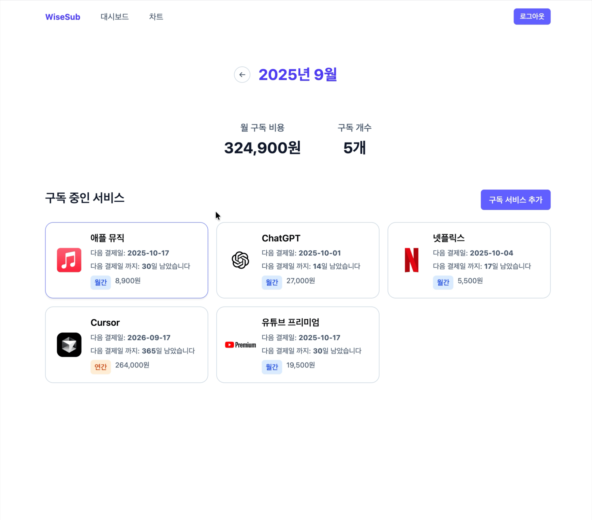

# WiseSub | 구독 관리 웹 서비스

<div align="center">
  
</div>

## 📋 프로젝트 소개

구독 서비스를 많이 이용하다 보니 결제일을 놓치거나, 사용 중인 서비스조차 기억하기 어려운 불편함이 있었습니다. 이를 해결하기 위해, 사용자가 구독 현황을 관리할 수 있는 웹 서비스를 개발했습니다.

<br />

## 기능 시연


<br />



<br />

## 프로젝트 구조

```bash
src/
├── api/
│   ├── auth.ts       # 인증 API
│   └── subscription.ts # 구독 CRUD API
├── components/
│   ├── common/       # 공통 컴포넌트
│   ├── dashboard/    # 대시보드 관련 컴포넌트
│   └── layout/       # 레이아웃 컴포넌트
├── hooks/            # 커스텀 훅
├── pages/
│   ├── HomePage.tsx         # 메인 홈페이지
│   ├── LoginPage.tsx        # 로그인 페이지
│   ├── SignUpPage.tsx       # 회원가입 페이지
│   ├── DashboardPage.tsx    # 구독 관리 대시보드 페이지
│   ├── AddSubscriptionPage.tsx # 구독 서비스 추가 페이지
│   └── ChartPage.tsx        # 차트 페이지
├── types/            # TypeScript 타입 정의
├── utils/            # 유틸리티 함수
├── constants/        # 상수 (서비스 목록 등)
└── assets/           # 정적 리소스 (아이콘, 로고)
```

<br />

## 기술 스택

- **Frontend**
  - React + TypeScript
  - Tailwind CSS
  - Tanstack Query
  - Recharts

- **Backend**
  - Supabase

- **Development Tools**
  - Vite
  - Git
  - GitHub
  - Vercel (배포)
